# Edemy LMS - Activity Diagrams

## 1. User Authentication Flow

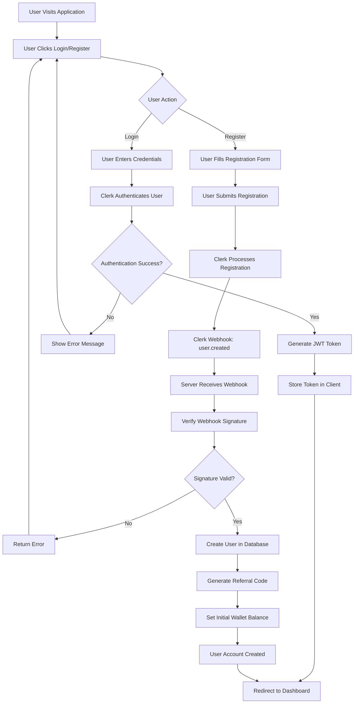

## 2. User Purchase Course Flow

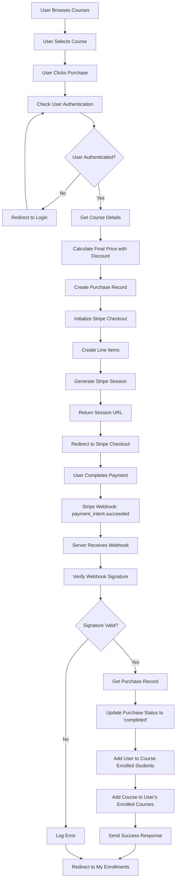

## 3. Educator Upload Course Flow

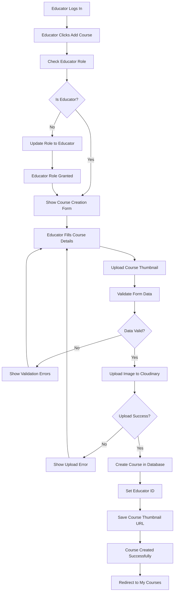

## 4. Educator Delete Course Flow

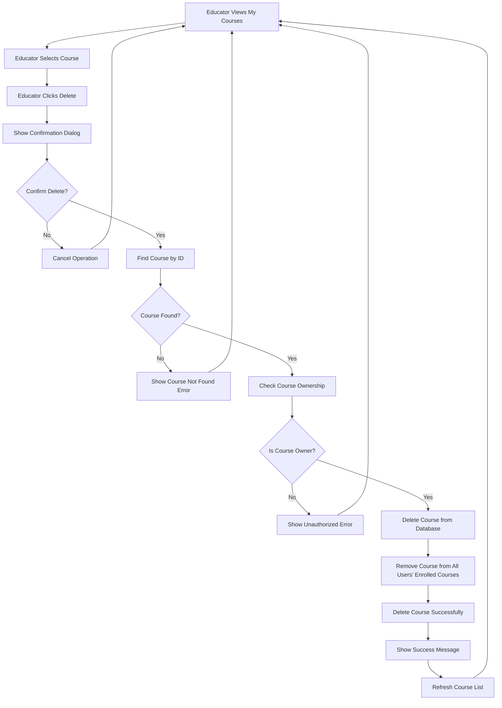

## 5. Educator Update Course Flow

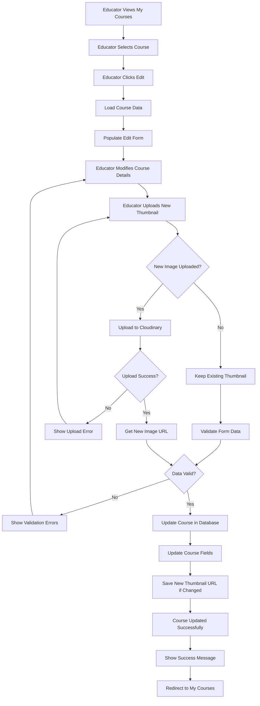

## 6. Complete Course Purchase with Progress Tracking

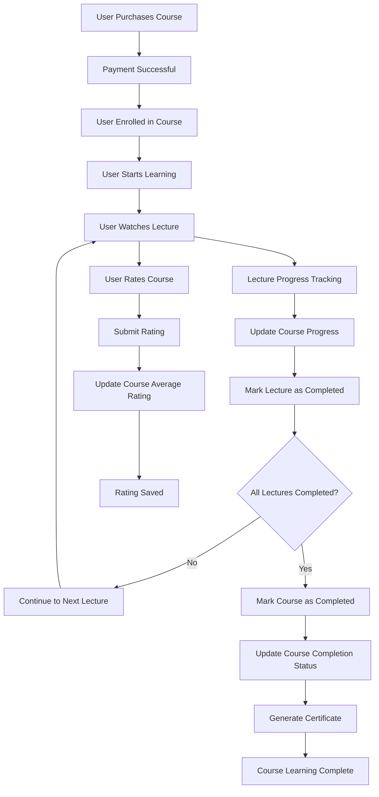

## 7. Educator Dashboard Analytics Flow

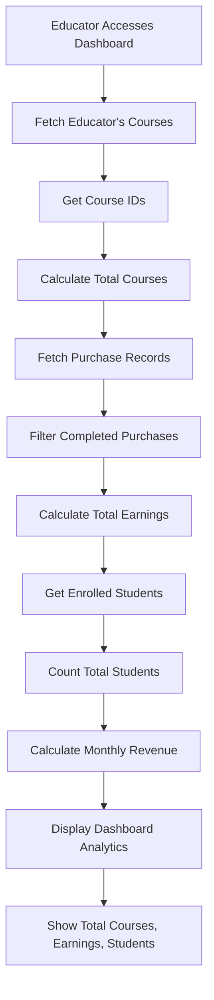

## 8. Webhook Processing Flow

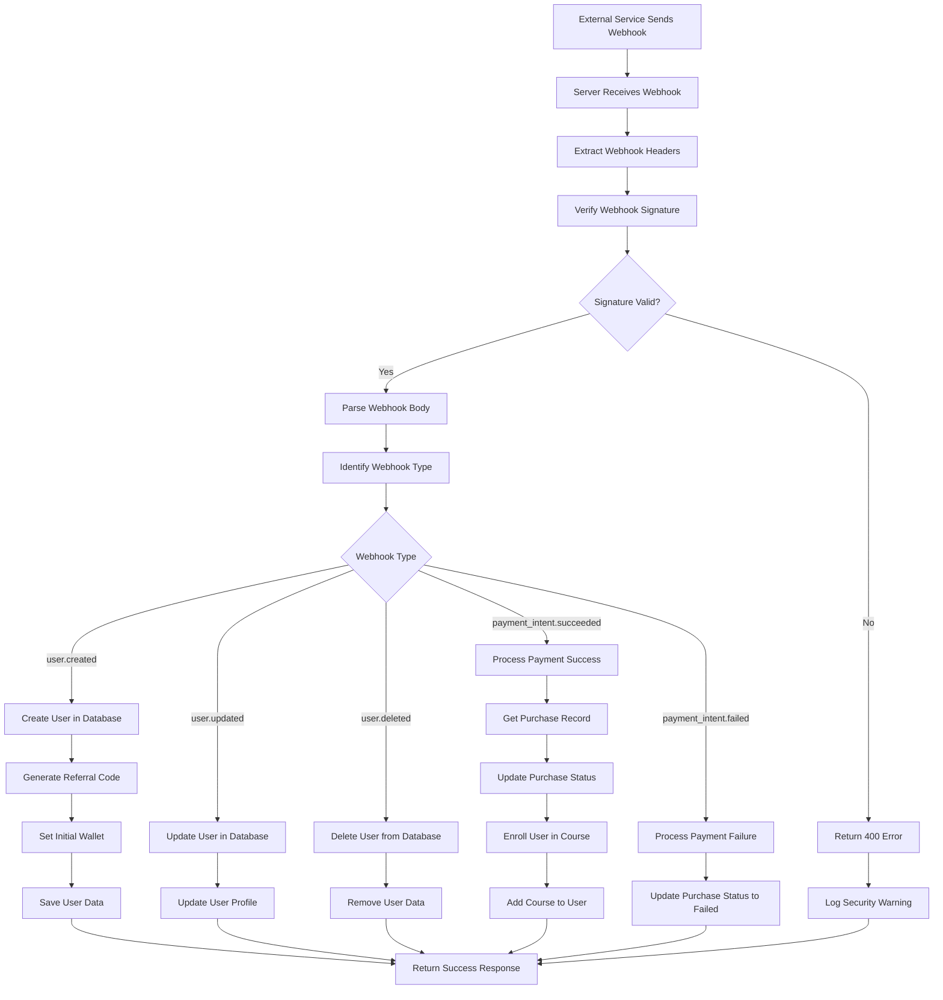

---

# Edemy LMS - Sequence Diagrams

## 1. User Authentication Sequence Diagram

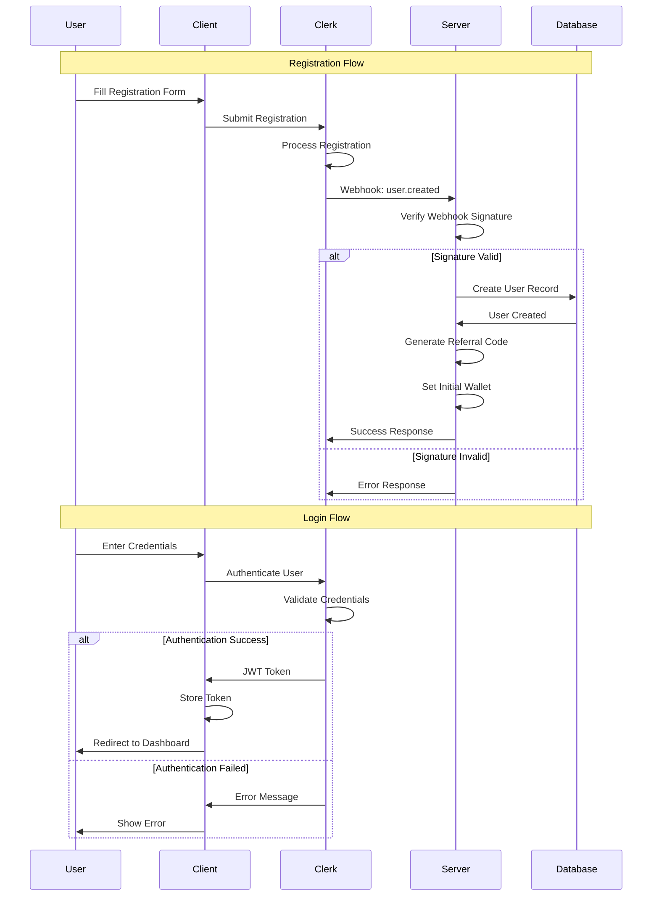

## 2. User Purchase Course Sequence Diagram

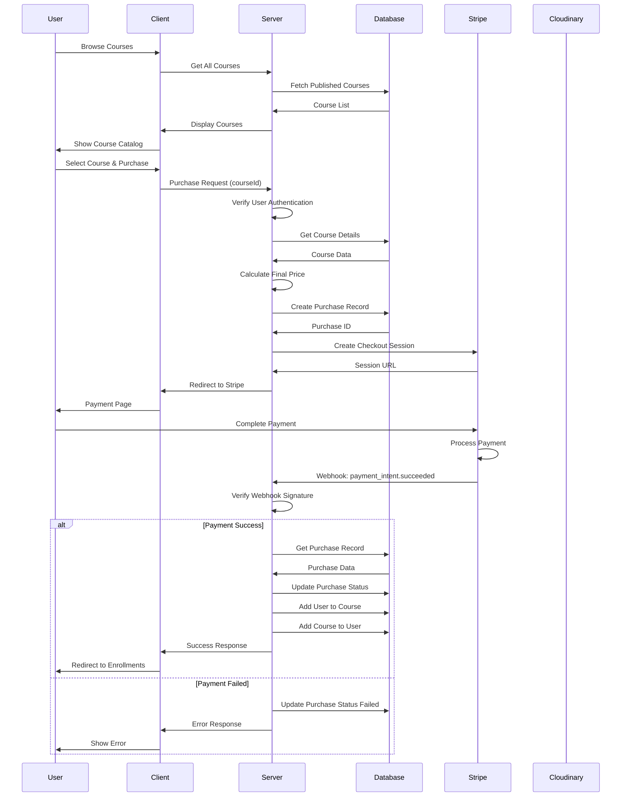

## 3. Educator Course Management Sequence Diagram

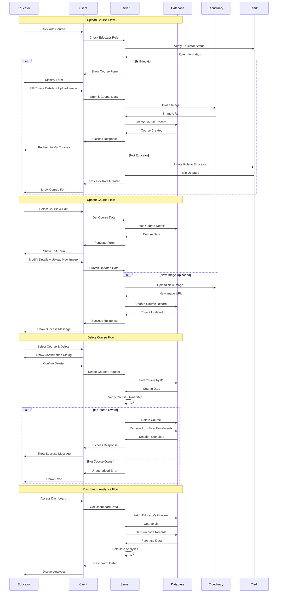