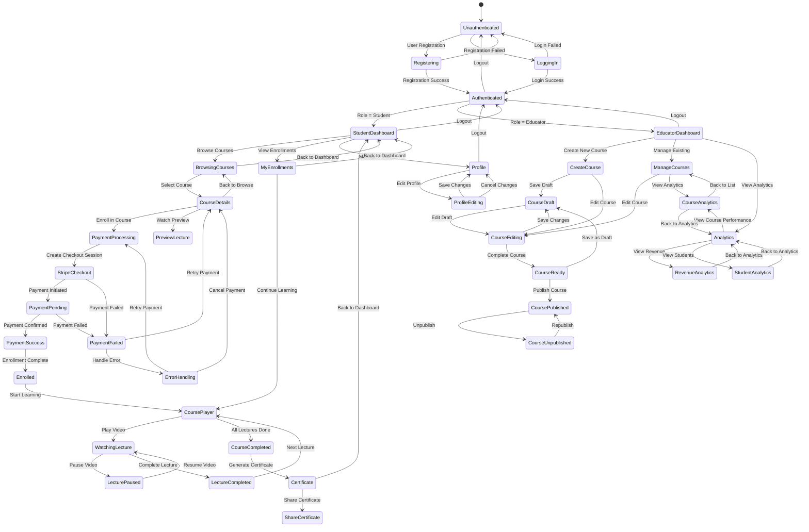

# Edemy LMS - State Diagram (Mermaid Syntax)

## Complete System State Diagram

## State Descriptions

### Authentication States
- **Unauthenticated**: User not logged in
- **Registering**: User creating account
- **LoggingIn**: User attempting login
- **Authenticated**: User successfully logged in

### Student States
- **StudentDashboard**: Main student interface
- **BrowsingCourses**: Viewing available courses
- **CourseDetails**: Viewing specific course
- **PreviewLecture**: Watching free preview
- **MyEnrollments**: Viewing enrolled courses

### Payment States
- **PaymentProcessing**: Initiating enrollment
- **StripeCheckout**: Payment gateway interface
- **PaymentPending**: Payment being processed
- **PaymentSuccess**: Payment completed
- **PaymentFailed**: Payment failed
- **Enrolled**: Successfully enrolled

### Learning States
- **CoursePlayer**: Main learning interface
- **WatchingLecture**: Actively watching video
- **LecturePaused**: Video paused
- **LectureCompleted**: Lecture finished
- **CourseCompleted**: All content completed
- **Certificate**: Course completion certificate

### Educator States
- **EducatorDashboard**: Main educator interface
- **CreateCourse**: Creating new course
- **CourseDraft**: Course saved as draft
- **CourseEditing**: Modifying course
- **CourseReady**: Course content complete
- **CoursePublished**: Course live and available
- **CourseUnpublished**: Course temporarily unavailable

### Analytics States
- **Analytics**: Main analytics dashboard
- **RevenueAnalytics**: Financial performance
- **StudentAnalytics**: Student engagement
- **CourseAnalytics**: Course performance

### Profile States
- **Profile**: User profile view
- **ProfileEditing**: Modifying profile

### Error States
- **ErrorHandling**: Handling system errors 